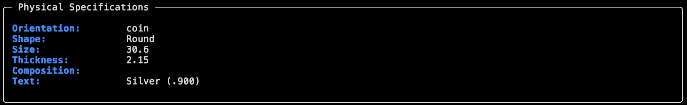
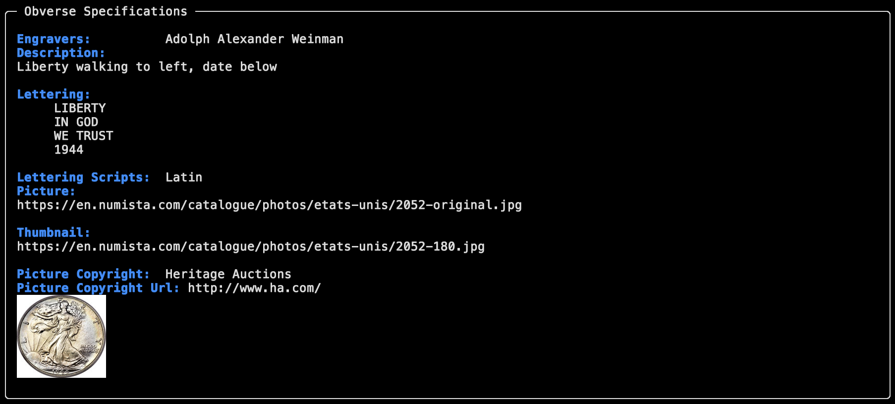
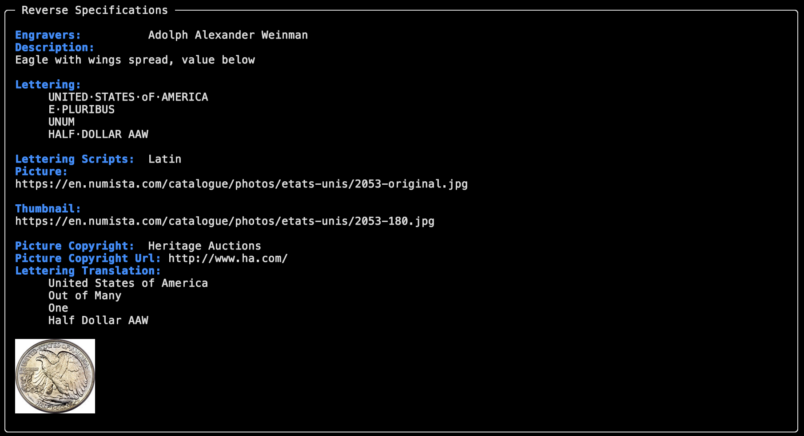
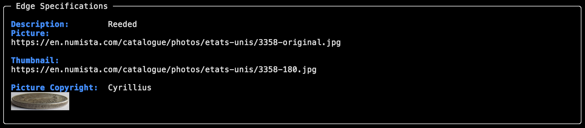

# numistalib

[](https://github.com/wells01440/numistalib/actions/workflows/test.yml) [](https://numistalib.readthedocs.io/en/latest/?badge=latest) [](https://pypi.org/project/numistalib/) [](https://github.com/wells01440/numistalib/actions/workflows/release.yml) [](https://opensource.org/licenses/MIT)

**A Python caching API wrapper for the Numista numismatic database with RFC 9111-compliant HTTP caching, intelligent rate limiting, and resilient retry logic.**

Includes an optional command-line interface with rich terminal output and sixel image support.

## Overview

numistalib is a **caching API client** for [Numista](https://en.numista.com), the collaborative online catalogue of world coins, banknotes, and exonumia. The library:

- **Caches all GET requests** using [hishel](https://hishel.com) with configurable TTL (default 7 days)
- **Rate limits** requests automatically (45 requests/minute by default) via [pyrate-limiter](https://github.com/vutran1710/PyrateLimiter)
- **Retries failed requests** with exponential backoff and jitter using [tenacity](https://tenacity.readthedocs.io/)
- **Validates all responses** with strict [Pydantic](https://docs.pydantic.dev/) models
- **Provides both sync and async** client implementations via [httpx](https://www.python-httpx.org/)

Includes a CLI for interactive exploration with [Rich](https://rich.readthedocs.io/) terminal output and sixel protocol image display.

## 📖 Documentation

**[Read the Docs](https://numistalib.readthedocs.io/)** — Complete documentation with search, versioning, and offline formats.

**Quick Links:**

- [Installation](https://numistalib.readthedocs.io/en/latest/installation.html)
- [Quickstart](https://numistalib.readthedocs.io/en/latest/quickstart.html)
- [Python API Guide](https://numistalib.readthedocs.io/en/latest/python_api_guide.html)
- [CLI Guide](https://numistalib.readthedocs.io/en/latest/cli_guide.html)
- [API Reference](https://numistalib.readthedocs.io/en/latest/api/)
- [Configuration](https://numistalib.readthedocs.io/en/latest/configuration.html)
- [Architecture](https://numistalib.readthedocs.io/en/latest/architecture.html)

## Features

### Core API Features

- **RFC 9111-Compliant HTTP Caching**: Persistent SQLite cache with configurable TTL and LRU eviction
- **Intelligent Rate Limiting**: Transport-level throttling with configurable limits (respects Numista quotas)
- **Resilient Retry Logic**: Exponential backoff with jitter for network failures and rate limit errors
- **Complete Type Safety**: Full Pydantic v2 models with strict validation for all API entities
- **Sync & Async Support**: Both synchronous and asynchronous client implementations
- **Cache Indicators**: Visual feedback (💾/🌐) for cache hits/misses in responses

### Optional CLI Features

- **Rich Terminal UI**: Beautiful tables, panels, and formatted output via [Rich](https://rich.readthedocs.io/)
- **Sixel Image Support**: Display coin images directly in terminal via sixel protocol ([textual-image](https://github.com/Textualize/textual-image))
- **Flexible Display Modes**: Table or panel mode for different output preferences
- **Command Aliases**: Short and long form commands (e.g., `catalogues` / `cat`)

## Installation

```bash
pip install numistalib
# or with uv
uv pip install numistalib
```

For development:

```bash
git clone https://github.com/wells01440/numistalib
cd numistalib
uv sync
```

## Configuration

1. Get your API key from [Numista API](https://en.numista.com/api/)
2. Set environment variable:

   ```bash
   export NUMISTA_API_KEY=your_api_key_here
   ```

   Or create `.env` file:

   ```bash
   cp .env.example .env
   # Edit .env and add: NUMISTA_API_KEY=your_api_key_here
   ```

## Quick Start

### Python API

```python
from numistalib.client import NumistaApiClient
from numistalib.config import Settings
from numistalib.services.types.service import TypeService

settings = Settings()  # Loads from environment/env file

with NumistaApiClient(settings) as client:
    service = TypeService(client)
    
    # Search for types (cached automatically)
    results = service.search_types(query="dollar", page=1, count=10)
    for coin_type in results:
        print(f"{coin_type.numista_id}: {coin_type.title}")
        print(f"  Cached: {coin_type.cached_indicator}")  # Shows 💾 or 🌐
    
    # Get full details with specifications
    full_type = service.get_type(95420)
    print(f"Weight: {full_type.weight}g")
    print(f"Composition: {full_type.composition}")
```

See [Python API Guide](https://numistalib.readthedocs.io/en/latest/python_api_guide.html) for complete examples.

### CLI

Interactive exploration with rich terminal output.

#### Basic Commands

```bash
# Search for types
numistalib types search -q "dollar"
numistalib types search --issuer united-states --year 2020

# Get detailed specifications
numistalib types get 95420

# List available catalogues
numistalib catalogues

# List issuers in different languages
numistalib issuers --lang es

# View configuration
numistalib config list
```

#### Sixel Image Support

The CLI uses the [sixel protocol](https://en.wikipedia.org/wiki/Sixel) to display coin images in your terminal.

**Sixel-compatible terminals:**

- **[Kitty](https://sw.kovidgoyal.net/kitty/)** (macOS, Linux) — GPU-accelerated with full sixel support
- **[WezTerm](https://wezfurlong.org/wezterm/)** (macOS, Linux, Windows) — GPU-accelerated, full sixel support
- **[iTerm2](https://iterm2.com/)** (macOS) — Inline image display
- **[mlterm](https://sourceforge.net/projects/mlterm/)** (Linux) — Lightweight sixel support
- **[foot](https://codeberg.org/dnkl/foot)** (Linux/Wayland) — Fast, minimal
- **[yaft](https://github.com/uobikiemukot/yaft)** (Linux framebuffer) — Console sixel

**Testing Your Terminal:**

```bash
# Install imagemagick for testing
convert -size 100x100 xc:red sixel:- | cat
```

If you see a red square, your terminal supports sixel! If not, the CLI will gracefully fall back to text-only output.

**Example Output:**









See [CLI Guide](https://numistalib.readthedocs.io/en/latest/cli_guide.html) for complete command reference.

## Architecture

numistalib follows a layered architecture optimized for caching efficiency and maintainability:

- **client.py**: HTTP client layer with caching ([hishel](https://hishel.com)), rate limiting ([pyrate-limiter](https://github.com/vutran1710/PyrateLimiter)), and retry ([tenacity](https://tenacity.readthedocs.io/))
- **services/**: Business logic per API endpoint, inheriting from abstract base classes
- **models/**: Pydantic v2 models for strict API validation and type safety
- **config.py**: Settings management with [pydantic-settings](https://docs.pydantic.dev/latest/concepts/pydantic_settings/)
- **cli/**: Optional Click-based interface with [Rich](https://rich.readthedocs.io/) formatting and [textual-image](https://github.com/Textualize/textual-image) sixel support

See [Architecture Documentation](https://numistalib.readthedocs.io/en/latest/architecture.html) for detailed design patterns.

## Built With

numistalib is built on excellent open-source libraries:

### Core Dependencies

- **[httpx](https://www.python-httpx.org/)** — Modern HTTP client with sync/async support
- **[hishel](https://hishel.com)** — RFC 9111-compliant HTTP caching for httpx
- **[pydantic](https://docs.pydantic.dev/)** — Data validation using Python type annotations
- **[pydantic-settings](https://docs.pydantic.dev/latest/concepts/pydantic_settings/)** — Settings management
- **[pyrate-limiter](https://github.com/vutran1710/PyrateLimiter)** — Rate limiting strategies
- **[tenacity](https://tenacity.readthedocs.io/)** — Retrying library with configurable backoff

### CLI Dependencies

- **[click](https://click.palletsprojects.com/)** — Command-line interface creation kit
- **[rich](https://rich.readthedocs.io/)** — Rich text and beautiful formatting in terminal
- **[textual-image](https://github.com/Textualize/textual-image)** — Sixel protocol image rendering

### Development Tools

- **[uv](https://github.com/astral-sh/uv)** — Fast Python package installer and resolver
- **[ruff](https://docs.astral.sh/ruff/)** — Fast Python linter and formatter
- **[pytest](https://docs.pytest.org/)** — Testing framework
- **[mypy](https://mypy-lang.org/)** & **[pyright](https://github.com/microsoft/pyright)** — Static type checkers

## Contributing

Contributions are welcome! This project follows community best practices:

1. **Code of Conduct**: Be respectful and inclusive
2. **Issues**: Report bugs or request features via [GitHub Issues](https://github.com/wells01440/numistalib/issues)
3. **Pull Requests**: Fork, branch, and submit PRs with clear descriptions
4. **Code Quality**: All PRs must pass linting (ruff), type checking (mypy/pyright), and tests (pytest)
5. **Documentation**: Update relevant docs for user-facing changes

See [Contributing Guide](https://numistalib.readthedocs.io/en/latest/contributing.html) and [AGENTS.md](AGENTS.md) for coding standards.

## Community Standards

- **License**: [MIT License](license.txt) — Free and open source
- **Versioning**: [Semantic Versioning](https://semver.org/) (MAJOR.MINOR.PATCH)
- **Changelog**: [Keep a Changelog](https://keepachangelog.com/) format in [CHANGELOG](CHANGELOG)
- **Code Quality**: Enforced via CI (ruff, mypy, pyright, radon complexity checks)
- **Testing**: Comprehensive test suite with pytest
- **Documentation**: Complete user and API documentation on ReadTheDocs

## Legal & Attribution

### Numista

- **Unofficial**: This library is an independent, community project and is **not affiliated with Numista**.
- **Attribution**: Numista is a trademark/service of Numista. Please provide appropriate attribution when displaying data from Numista's API.
- **Terms of Use**: Users must comply with Numista's published terms:
  - [Conditions of Use](https://en.numista.com/conditions.php)
  - [Legal Information](https://en.numista.com/legal.php)
  - [Pricing API Terms](https://en.numista.com/api/pricing.php)
- **Data Usage**: Follow Numista's guidelines for caching, rate limits, and redistribution. Configure TTL and cache behavior according to Numista's restrictions, especially for pricing data.
- **Rate Limiting**: This project implements conservative rate limiting by default (45 requests/minute); always respect Numista's published limits and guidance.

### License

This project is licensed under the [MIT License](license.txt). See the license file for details.

---

**Questions?** Check the [documentation](https://numistalib.readthedocs.io/) or [open an issue](https://github.com/wells01440/numistalib/issues).
